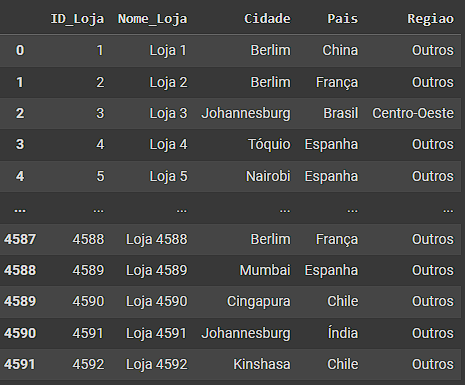
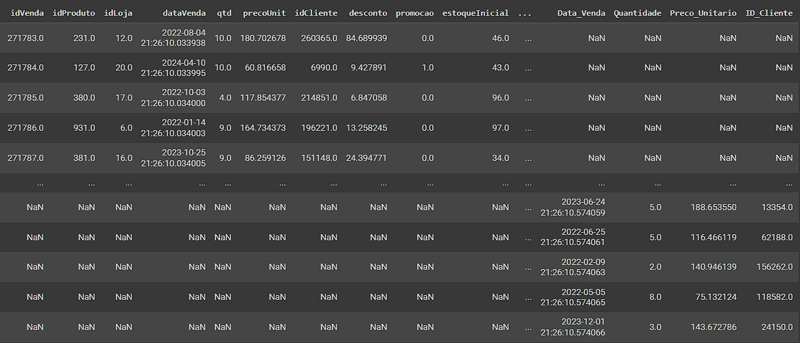
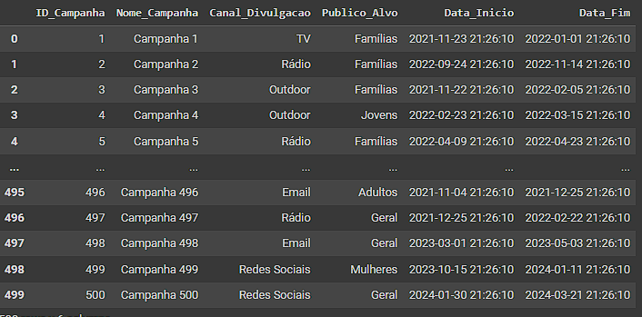
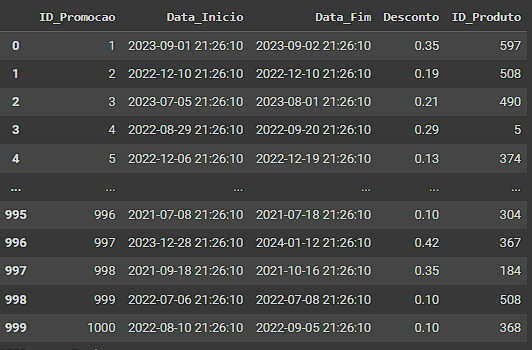
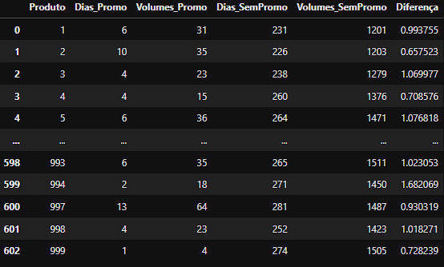
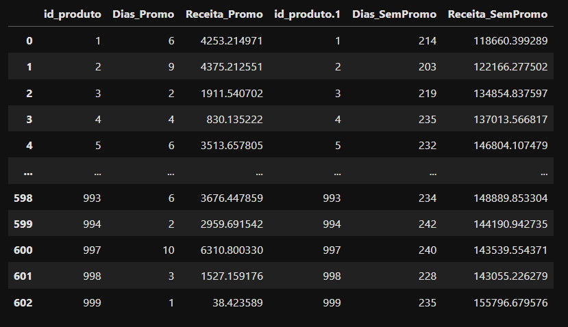

# Projeto Varejo - Consuelo

Recebemos dados com alguns problemas de estrutura. Recomendo que leia esse README em conjunto com o código feito pelo [Google Colab](https://colab.research.google.com/drive/13efcBLyRUKfaPaEG5CyPOlCrW2iXfT_r?usp=drive_link), para visualizar uma explicação passo a passo dos processos citados abaixo.


## 📚 *Bibliotecas utilizdas*
- ***Pandas*** (para manipulação de dataframes)


## ➡️ *lojas.csv*
### ‎ ↳ Erros encontrados:
- Encontramos incompatibilidades entre as colunas **cidades**, **países** e **região**




### ✔ Tratando o erro:
- Primeiro criamos um dicionário python, onde as cidades são as chaves e os países os valores dos mesmos.
- Após isso criamos um laço de repetição onde o código irá identificar a cidade na tabela e irá adicionar, automaticamento, o país correspondente.
- Por fim, desconsideramos a coluna de região, visto que a mesma só estavam especificadas para as lojas instaladas no Brasil.

## ➡️ *vendas_online.json*
### ‎ ↳ Erros encontrados:
- Encontramos colunas duplicadas, com mesmas informações e propósito. Entretanto as células não seguiam a mesma lógica, gerando colunas vazias.



### ✔ Tratando o erro:
- Descobrimos através de um laço de repetição, a exata linha onde essa tabela começa a se dividir.
- Preenchemos as células vazias da segunda metade da tabela com "duplicatas" das primeiras células.
- Terminado esse processo, excluímos as colunas que não farão falta em nossa tabela final.


## ➡️ *campanhas_marketing.csv* e *promocoes.csv*
### ‎ ↳ Erros encontrados:
- As datas estavam com horas, minutos e segundos idênticos em todas as células, então decidimos deixar as colunas de vendas mostrando apenas dia, mês e ano.




### ✔ Tratando o erro:
- Transformamos o tipo das colunas de *string* para *datetime*.

- A partir disso, apenas especificamos para o pandas mostrar as informações no formato ano/mês/dia.


# Principais testes realizados

## Teste T de Student

O teste t de Student é um teste estatístico que compara as médias de dois grupos para determinar se há uma diferença estatisticamente significativa entre elas. É particularmente útil quando você deseja verificar se dois grupos são significativamente diferentes em termos de uma variável específica.

## O que é a Estatística T?
- **Estatística T (T-statistic):** Mede a diferença entre as médias dos dois grupos em termos de unidades de desvio padrão. Um valor t maior em magnitude (positivo ou negativo) indica uma diferença maior entre as médias dos grupos.
- **Valor t positivo:** Indica que a média do primeiro grupo (por exemplo, vendas durante promoções) é maior do que a média do segundo grupo (vendas fora das promoções).
- **Valor t negativo:** Indica que a média do primeiro grupo é menor do que a média do segundo grupo.

## P-valor
- **P-valor (P-value):** Indica a probabilidade de observar uma diferença entre as médias pelo menos tão extrema quanto a observada, assumindo que a hipótese nula (de que não há diferença entre as médias) é verdadeira.
- **P-valor baixo (geralmente < 0.05):** Sugere que a diferença observada nas médias não é devida ao acaso e é estatisticamente significativa. Nesse caso, rejeitamos a hipótese nula.
- **P-valor alto (geralmente ≥ 0.05):** Sugere que a diferença observada pode ser devida ao acaso, e não há evidência suficiente para rejeitar a hipótese nula.


# Principais Insights

### *- As promoções prejudicam as vendas* 👎

A partir dos dados fornecidos, criamos uma nova tabela via MySQL e nela realizamos alguns testes de significância para verificar se as promoções foram benéficas ou não para a nossa rede de lojas.




Em nossos [testes realizados](Relacoes/DiferençaPromoções/DiferençaPromoções.ipynb), verificamos que:

- O valor do nosso t-statistic foi igual a **```-0.9818489504625452```**

- O nosso p-valor foi igual a **```0.32637152024096383```**

### Conclusão

Com base nesses resultados, podemos concluir que as promoções não tiveram um impacto estatisticamente significativo nas vendas. A pequena diferença observada entre as vendas durante as promoções e fora das promoções pode ser devida ao acaso.


### *- As promoções alavancam a receita* 👍

A partir dos dados fornecidos, criamos uma nova tabela via MySQL e nela realizamos alguns testes de significância para verificar se as promoções foram benéficas ou não para a nossa rede de lojas.




Em nossos [testes realizados](Relacoes/DiferençaPromoçõesReceita/DiasPromoReceita.ipynb), verificamos que:

- O valor do nosso t-statistic foi igual a **```0.15614170536662791```**

- O nosso p-valor foi igual a **```0.8759475007859607```**

### Conclusão

Com base nos resultados do teste t realizado, não encontramos evidências estatísticas suficientes para concluir que as promoções tiveram um impacto significativo na receita. O valor do teste t foi de 0.156, e o valor p associado foi de 0.876.

Portanto, com um nível de significância típico de 0.05, não rejeitamos a hipótese nula de que não há diferença significativa entre a receita média por dia durante as promoções e fora delas. A pequena diferença observada entre as médias de receita pode muito bem ser devido ao acaso ou variabilidade natural nos dados.

Assim, podemos concluir que as promoções não tiveram um impacto estatisticamente significativo na receita, com base na análise realizada.
